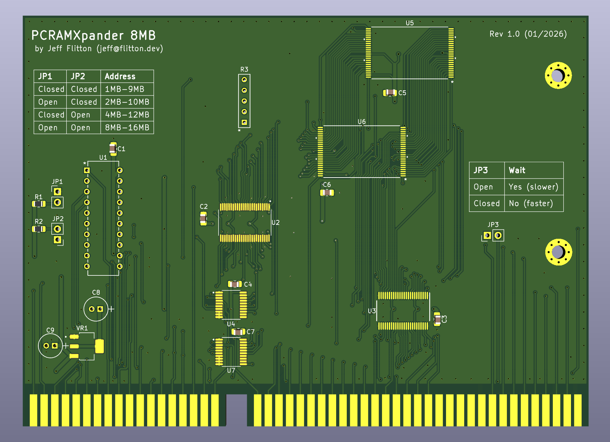

# PCRAMXpander

> **Note:** This project is currently untested. The first batch of boards has been ordered for testing.

An 8MB memory expansion card for the 16-bit ISA bus, designed as a modern alternative to the somewhat difficult to find ISA version of [IBM's Memory Expansion boards](https://www.ardent-tool.com/memory/IBM_Expansion.html#1_8MB).

This card should likely only be used in systems where the ISA bus is clocked at the same rate as the processor (often the case for 286-based systems).  While this board should work on faster 386 and 486-based systems, this board's memory will significantly underperform the motherboard-attached memory.

## Features

- **8MB total memory** using two 4MB SRAM chips (AS6C3216A)
- **Configurable base address** supporting systems with 1MB, 2MB, 4MB, or 8MB of existing memory
- **Zero wait state mode** for faster memory access on supported systems
- **Simple design** with address decoding handled by a single GAL (ATF16V8B)

## Configuration

### Memory Jumpers (JP1, JP2)

Configure the board's starting address based on your system's existing memory:

| Existing Memory | JP1    | JP2    | Memory Range      |
|-----------------|--------|--------|-------------------|
| 1MB             | Closed | Closed | 1MB – 9MB         |
| 2MB             | Open   | Closed | 2MB – 10MB        |
| 4MB             | Closed | Open   | 4MB – 12MB        |
| 8MB             | Open   | Open   | 8MB – 16MB        |

> **Note:** Configurations with less than 1MB of existing memory are not currently supported.

### Zero Wait State Jumper (JP3)

Installing a jumper on JP3 enables zero wait state mode. This is **recommended** for systems that support it, as it significantly improves memory access performance.

## Theory of Operation

### Overview

The PCRAMXpander provides 8MB of additional memory to an ISA-bus system using two 4MB SRAM chips. A GAL (U1) handles address decoding, while buffer ICs manage the data and address buses.

### Address Decoding (U1 – ATF16V8B)

The GAL monitors the upper address lines (LA23–LA20) to determine which 1MB block is being accessed. Based on the jumper configuration (JP1, JP2), it calculates whether the requested address falls within the board's memory range.

The memory is split into two 4MB banks:
- **Low bank (U5):** First 4MB of the expansion range
- **High bank (U6):** Second 4MB of the expansion range

The GAL generates active-low chip select signals (`CS_LO`, `CS_HI`) for each bank. It also asserts:
- **MEMCS16:** Indicates 16-bit memory is present at this address
- **NOWS:** Signals zero wait state capability (directly from JP3 setting)

Both MEMCS16 and NOWS are active-low, open-collector outputs, allowing multiple ISA cards to share these signals.

### Bus Interface

| IC  | Function |
|-----|----------|
| U2 (SN74LVCR16245ADGGR) | Bidirectional 16-bit data buffer between ISA bus and SRAM |
| U3 (SN74LVC16244ADGGR) | 16-bit address buffer (A1–A16) |
| U4 (SN74LVC16244A) | Additional address buffering |
| U7 (SN74LVC573APWR) | Address latch for upper address bits |

The data buffer (U2) is enabled by the `TRANS_EN` signal from the GAL whenever either SRAM chip is selected. Its direction is controlled by the ISA bus read/write signals.

### Power Supply

A 3.3V LDO regulator (VR1 – LDL1117S33R) provides power to the low-voltage SRAM and buffer ICs from the ISA bus 5V rail. Bypass capacitors ensure stable operation.

### Timing

When zero wait state mode is enabled (JP3 closed), the board signals to the host that no additional wait states are required for memory access. The AS6C3216A SRAM has a 55ns access time, which is fast enough for zero wait state operation on most ISA systems.

## License

This work is licensed under the [Creative Commons NonCommercial 4.0 International license](https://creativecommons.org/licenses/by-nc/4.0/).

## Authors

- [Jeff Flitton](mailto:jeff@flitton.dev) – Project creator

## Disclaimer

This project is provided as-is, without any express or implied warranty. By using, building, or modifying this hardware, you acknowledge that you do so at your own risk. The authors and contributors are not responsible for any damage, data loss, injury, or other consequences resulting from its use.

This project is a community-driven, open-hardware design intended for educational and hobbyist use. It is not affiliated with, endorsed by, or supported by IBM or any successor entities.

All trademarks are the property of their respective owners and are used here for descriptive and compatibility purposes only.
